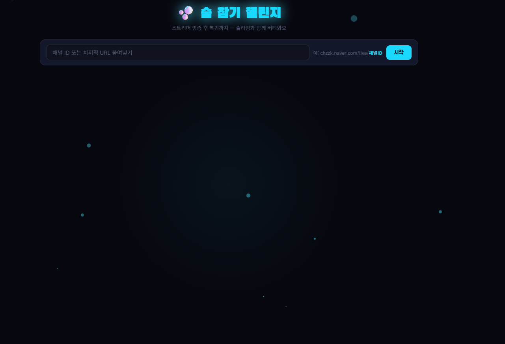
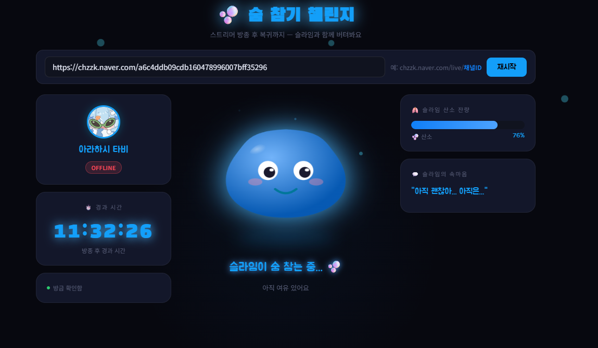

# 🫧 숨 참기 챌린지

> 치지직 스트리머 방종 후 복귀까지 — 슬라임과 함께 숨 참기



---

## 📖 소개

치지직(CHZZK) 스트리머가 방송을 종료한 순간부터 다시 켤 때까지,  
**거대한 슬라임 캐릭터와 함께 숨을 참으며 기다리는** 인터랙티브 웹 앱입니다.

시간이 지날수록 슬라임이 파란색 → 보라색으로 물들어가고,  
스트리머가 복귀하는 순간 컨페티가 터지며 슬라임이 되살아납니다. 🎊

**Discord 봇**이 Railway에서 24시간 방송 상태를 모니터링하며,  
방종/복귀 시 자동으로 알림을 전송합니다.

---

## ✨ 주요 기능

### 🖥 슬라임 UI (로컬)

- 🔵 **슬라임 색상 변화** — 방종 후 경과 시간에 따라 파란색 → 보라색으로 점진적 변화
- 😊→😵 **표정 변화** — 여유로움 → 불안 → 한계 3단계 표정 연출
- 🫧 **슬라임 클릭** — 클릭하면 출렁이는 젤리 인터랙션
- ⏱ **정확한 타이머** — 치지직 API의 실제 방송 종료 시각(`closeDate`) 기준으로 계산
- 🕐 **방종 시각 표시** — "XX월 XX일 XX시 XX분에 방종" 형식으로 표시
- 🎊 **복귀 감지** — 방송 재개 시 컨페티 폭발 + 슬라임 부활 애니메이션
- 🏆 **복귀 기록** — 회차별 숨 참기 시간 기록

### 🤖 Discord 봇 (Railway 24시간)

- 🔴 **방종 감지 알림** — 방송 종료 시 자동으로 Discord 채널에 알림 전송
- 🟢 **복귀 감지 알림** — 방송 복귀 시 @everyone 알림 + 방종 시간 표시
- `/상태` **슬래시 명령어** — 현재 방송 상태 및 경과 시간 즉시 확인

---

## 🖥 실행 화면



---

## 🛠 기술 스택

| 분류       | 기술                     |
| ---------- | ------------------------ |
| Backend    | FastAPI, httpx           |
| Frontend   | Vanilla HTML / CSS / JS  |
| Discord 봇 | discord.py               |
| API        | 치지직(CHZZK) 비공식 API |
| 배포       | Railway                  |

---

## 🚀 실행 방법

### 슬라임 UI (로컬)

#### 1. 환경변수 설정

```bash
cp .env.example .env
```

`.env` 파일을 열어 값 입력:

```env
DISCORD_BOT_TOKEN=봇_토큰
DISCORD_WEBHOOK_URL=웹훅_URL
CHZZK_CHANNEL_ID=치지직_채널_ID
POLL_INTERVAL=5
```

#### 2. 의존성 설치

```bash
pip install -r requirements.txt
```

#### 3. 서버 실행

```bash
uvicorn main:app --reload --port 8000
```

#### 4. 브라우저 접속

```
http://localhost:8000
```

---

### 🤖 Discord 봇 (Railway 배포)

#### 1. Railway 프로젝트 생성

1. [railway.app](https://railway.app) 접속 → GitHub 로그인
2. **New Project** → **GitHub 저장소** 선택
3. 이 레포지토리 선택

#### 2. 환경변수 설정

서비스 카드 클릭 → **Variables** 탭 → **Raw Editor**에 입력:

```env
DISCORD_BOT_TOKEN=봇_토큰
DISCORD_WEBHOOK_URL=웹훅_URL
CHZZK_CHANNEL_ID=치지직_채널_ID
POLL_INTERVAL=5
```

#### 3. 배포 완료

환경변수 저장 시 자동으로 재배포되며 24시간 봇이 작동합니다.

---

## 📁 프로젝트 구조

```
breath_challenge/
├── main.py             # FastAPI 서버 (슬라임 UI 백엔드)
├── bot.py              # Discord 봇 (24시간 방송 모니터링)
├── Dockerfile          # Railway 배포용
├── static/
│   └── index.html      # 슬라임 UI 프론트엔드
├── image/
│   ├── main.png
│   └── execution.png
├── .env.example        # 환경변수 예시
├── requirements.txt
└── .gitignore
```

---

## 📡 API 엔드포인트

| 엔드포인트                           | 설명                               |
| ------------------------------------ | ---------------------------------- |
| `GET /api/status/{channel_id}`       | 채널 방송 상태 및 경과 시간 조회   |
| `GET /api/channel-info/{channel_id}` | 채널 기본 정보 (이름, 아바타) 조회 |

---

## 💡 사용 방법

**슬라임 UI**

1. 치지직 채널 URL 또는 채널 ID 입력
   - 예: `https://chzzk.naver.com/live/abcd1234` 또는 `abcd1234`
2. **시작** 버튼 클릭
3. 슬라임과 함께 스트리머 복귀를 기다리기 🫧

**Discord 봇**

1. Discord 채널에서 `/상태` 입력 → 현재 방송 상태 확인
2. 방종/복귀 시 자동으로 알림이 옵니다

---

## ⚠️ 주의사항

- 치지직 **비공식 API**를 사용하므로 네이버 정책에 따라 동작이 변경될 수 있습니다.
- 개인 학습 및 비상업적 용도로만 사용해주세요.
- `.env` 파일은 절대 GitHub에 올리지 마세요.

---

## 👤 개발자

**bird8696** · [GitHub](https://github.com/bird8696)
